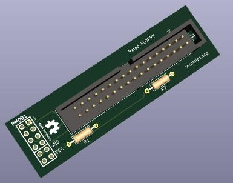
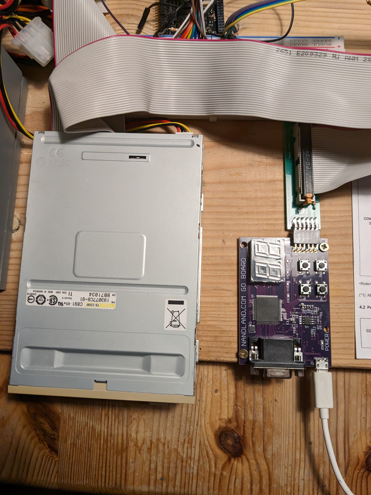

# Pmod-Floppy

This is a Kicad board design of a Pmod module for connecting standard PC floppy
drives to a FPGA. 
My main usecase was in teaching myself some FPGA programming using the Nandland
Go board. The software so far can be found [here](https://github.com/ZeroMips/floppy-fun),
I also documented my experience on the [blog](https://zeromips.org/posts/2024-01-08-superpower/).

This design has been production tested with JLCPCB.
Functional testing has also been performed, it works nicely.

